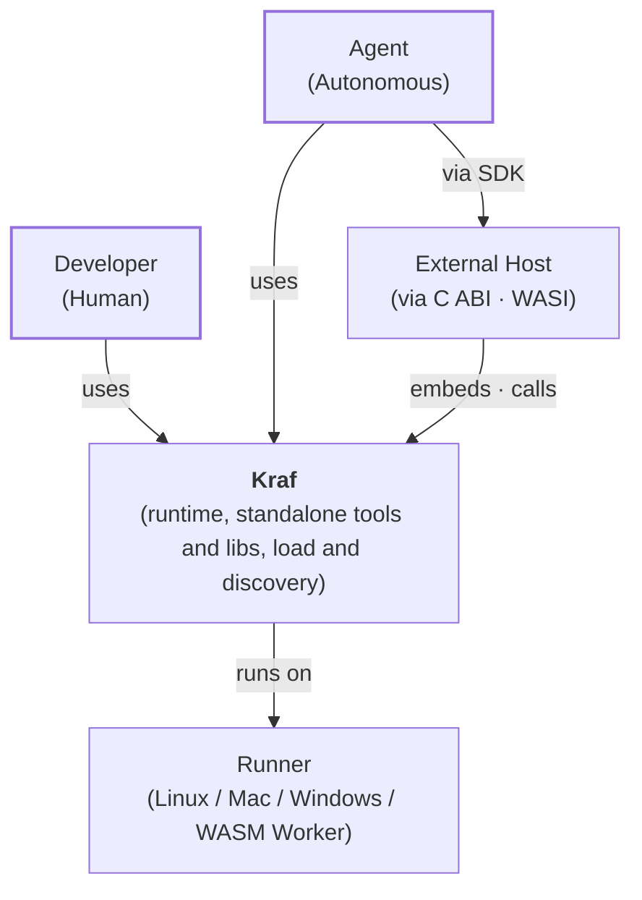
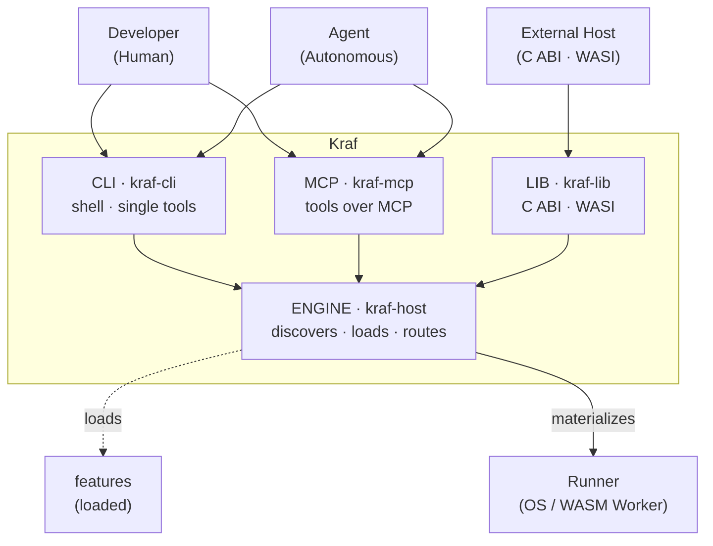
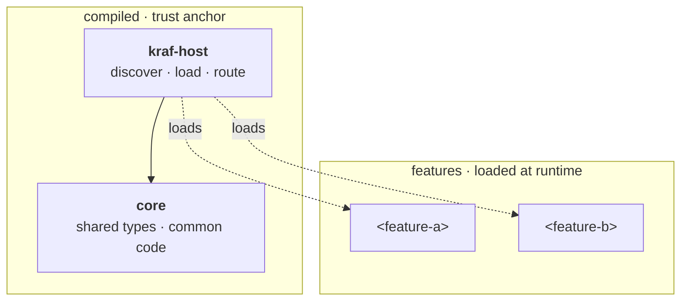
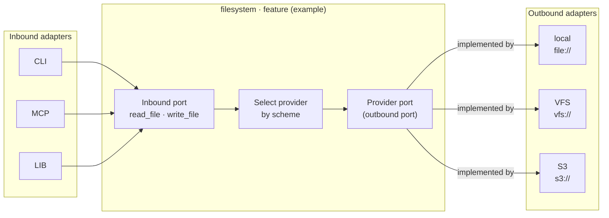
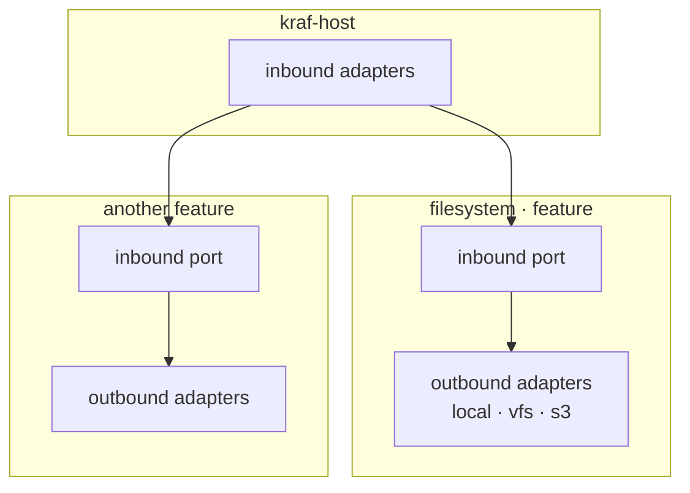

> [!IMPORTANT]
> The key words MUST, MUST NOT, REQUIRED, SHALL, SHALL NOT, SHOULD, SHOULD NOT,
> RECOMMENDED, MAY, and OPTIONAL follow RFC 2119 and RFC 8174.
>
> This document MUST use these terms, in uppercase, when expressing normative
> requirements, permissions, recommendations, or prohibitions. It MUST NOT use
> alternative words or lowercase variants as normative keywords.

---

> [!IMPORTANT]
> These are the Kraf codebase's **invariants** — non-negotiable rules that
> codebase MUST follow. Treat them like a constitution: you MUST NOT break an
> invariant, you **amend** it. Changing one is a deliberate decision made in a
> pull request that edits this file — it MUST NOT be an ad-hoc exception slipped
> into passing code.

## Overview

Kraf is a neutral layer for humans and autonomous agents: a consistent way to
describe a software project and materialize only what a workload proves it
needs, where it runs. It sits below editors, agent frameworks, and vendors, and
complements a project's existing sources rather than replacing them.

Its primary consumer is the agent CLI. Kraf provides tools that agents — and
humans — call to inspect and operate on a project, exposing it as an IDE
runtime: an isolated environment today, and its files, diagnostics, and language
tooling next. The tools are organized into features, each owning its
capabilities and their contracts, and reached through entrypoints — CLI, MCP, or
an embeddable library. A Kraf `_read_file_`, for example, returns a file's
content with a digest for conditional re-reads (a later read passing the digest
gets "not changed" instead of the bytes again) and metadata like line count and
MIME type, where a raw file read returns only bytes. It interoperates with
existing editors and toolchains instead of competing with them.

This document covers only what crosses module boundaries: the system context,
how modules relate, and the rules for how they depend on each other. Feature
behavior lives in each module's `README.md` and `docs/`.

> **Note:** this document describes Kraf's target architecture, including parts
> planned for its evolution. It does not imply that all of them are already
> implemented.

## System context



- Developer (human) and Agent (autonomous) both use Kraf to get and operate in a
  project runtime, through any of its surfaces — a shell, a single tool, or MCP.
  The surface is orthogonal to who drives it.
- External Host (C ABI · WASI): a program that embeds Kraf as a library and
  calls its tools. An agent reaches it through its own SDK — including agent
  SDKs (for example, the Vercel AI SDK or Cloudflare Agents), where Kraf's WASI
  tools are registered as function tools.
- Kraf: discovers and loads features, exposes a project runtime, standalone
  tools, and embeddable libraries, and materializes the runtime where the
  workload runs.
- Runner (Linux · Mac · Windows · WASM Worker): where Kraf materializes and runs
  the project runtime.

## Containers

Zooming into Kraf: actors reach it through its inbound adapters — `kraf-cli`,
the `kraf-mcp` server, and the `kraf-lib` embeddable library — all backed by the
**kraf-host**, which loads the needed features, routes each call to them, and
materializes the runtime onto the Runner. The entrypoint an actor picks is
orthogonal to the host behind it.



- CLI (`kraf-cli`): interactive shell and single-tool invocations.
- MCP (`kraf-mcp`): exposes the same tools over MCP.
- LIB (`kraf-lib`): linked by an External Host to call tools in-process (C ABI ·
  WASI).
- ENGINE (`kraf-host`): discovers and loads features, routes calls to them, and
  materializes the runtime onto the Runner.

The local actors (developer, agent) can reach any inbound adapter; the external
host reaches Kraf through the embeddable lib. How a feature exposes itself and
plugs in adapters is covered in [Ports and adapters](#ports-and-adapters).

## Module map

Kraf is organized by domain (folder-per-feature), not by language, and composed
dynamically. What is compiled together into the trusted base is small:
**kraf-host** and the **core**. Above them, each **feature** is compiled on its
own, discovered from a manifest, and loaded by kraf-host at runtime, lazily on
first use. The architecture knows only this shape, not the specific features.

A feature declares in its manifest what it contributes — the tools it exposes
(its inbound port, e.g. `read_file`/`write_file`) — and when to activate.
kraf-host builds a registry from those manifests, loads a feature the first time
it is needed, and exposes its tools through the unified `cli`/`mcp`/`lib`
surface. A feature keeps its own registry for its providers and routes each call
to the one matching the scheme; providers are internal to the feature, not units
kraf-host loads.

```text
src/
├── host/           # compiled: kraf-host — discover · load · route features
├── core/           # compiled: shared types · common code; no dependencies
├── <feature-a>/    # a feature kraf-host discovers and loads at runtime
└── <feature-b>/    # another feature (bundles its own providers)
```

The host and core are compiled together and depend only inward (host → core →
nothing). Each feature is compiled on its own against the core's contracts and
loaded by kraf-host at runtime, not linked into it.



## Ports and adapters

Kraf uses ports and adapters in the standard sense, with two contracts per
feature. Inbound adapters (`cli`, `mcp`, `lib`) receive external calls and
forward them to the feature's **inbound port** — its operations, e.g.
`read_file`/`write_file`. The feature then selects an outbound adapter by scheme
and calls it through its **provider port**, the outbound contract that adapters
implement (like VS Code's `FileSystemProvider`). A feature owns its ports and
adapters — the core does not.

> The names shown here (filesystem, read_file, local, ...) are illustrative, not
> a final inventory.

- Inbound adapters: `cli`, `mcp`, `lib` — forward external calls to the inbound
  port (see [Containers](#containers)).
- Inbound port: what the feature exposes — e.g. `read_file`/`write_file`.
- Feature logic: resolves the scheme to one of its providers (via the feature's
  own registry) and calls the provider port.
- Provider port (outbound): the contract outbound adapters implement (like VS
  Code's `FileSystemProvider`).
- Outbound adapters (providers): implement the provider port, one per scheme;
  several can be active at once. The folder name for these is not decided yet.

As a concrete example, a `filesystem` feature — a tool for reading and writing
files, where the scheme selects the provider:



Zoomed out, the kraf-host's `cli`, `mcp`, and `lib` inbound adapters reach
several loaded features. A single call reaches one or more feature inbound
ports, each routed to its own outbound adapters.



## Dependency rule

Dependencies MUST point inward and MUST NOT form a cycle.

- The host and core are compiled together and MUST depend only inward: host →
  core → nothing. Each feature is compiled on its own against the core's
  contracts and loaded by the host; it MUST NOT depend on the host's internals.
- A feature MAY also depend on a more foundational one that many build on — for
  example one that reads environment variables. What is widely shared and stable
  settles toward the core; behavior on top of it stays a feature.
- An outbound adapter MUST depend only on the provider port it implements. A
  feature MUST depend on its provider port, not on which adapter runs — the
  adapter is selected by scheme.
- The core MUST know nothing about features, ports, or adapters, and a feature
  MUST know nothing about who calls its inbound adapters.

This keeps the graph acyclic and every feature testable in isolation.

## Decisions

Cross-domain decisions. Feature-specific decisions live as ADRs in their
modules.

- Organize by domain (folder-per-feature), not by language — language is an
  implementation detail a domain can add beside the rest.
- Composition is dynamic: kraf-host and the core are compiled together — the
  trusted base — while each feature is compiled as its own module, discovered
  from its manifest, and loaded by kraf-host at runtime on first use, like VS
  Code extensions. A feature bundles its own providers.
- Ports and adapters per feature: an inbound port for what it exposes and a
  provider port for what it depends on, with outbound adapters (providers)
  selected by scheme and able to coexist.
- The core is foundational (shared types · common code) and depends on nothing —
  a trust anchor everything can rely on.
- Dependencies point inward and stay acyclic — features stay replaceable and
  testable in isolation.
- The materialization target is a Runner (OS or WASM worker), not a fixed OS.

## Related docs

- [README.md](../README.md): what Kraf is.
- [GENERAL_CONVENTIONS.md](./GENERAL_CONVENTIONS.md): repo conventions.
